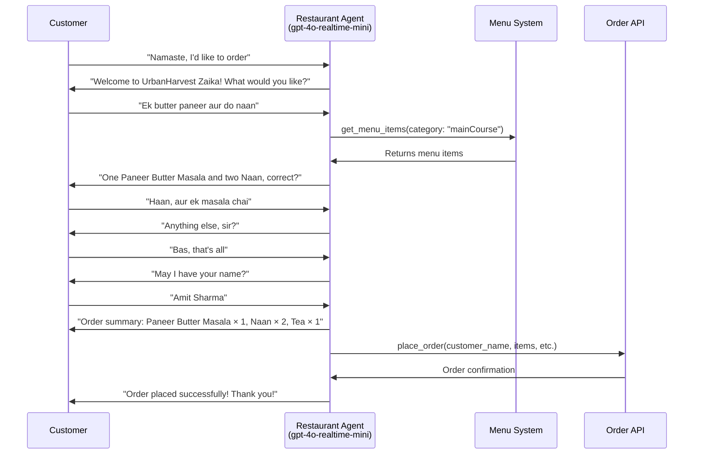

# Restaurant Order Taking Agent

This is a demonstration of a voice-based restaurant order taking system using the OpenAI Realtime API and the OpenAI Agents SDK. The agent acts as a friendly Indian restaurant assistant that can take food orders in natural conversation, including Hinglish (Hindi-English mix).

## About the OpenAI Agents SDK

This project uses the [OpenAI Agents SDK](https://github.com/openai/openai-agents-js), a toolkit for building, managing, and deploying advanced AI agents. The SDK provides:

- A unified interface for defining agent behaviors and tool integrations.
- Built-in support for agent orchestration, state management, and event handling.
- Easy integration with the OpenAI Realtime API for low-latency, streaming interactions.
- Extensible patterns for multi-agent collaboration, handoffs, tool use, and guardrails.

For full documentation, guides, and API references, see the official [OpenAI Agents SDK Documentation](https://github.com/openai/openai-agents-js#readme).

## Restaurant Order Agent Features

The restaurant order agent demonstrates:
- **Natural Language Processing:** Understanding customer orders in English and Hinglish
- **Menu Integration:** Access to a complete Indian restaurant menu with prices and descriptions
- **Order Management:** Collecting items, quantities, special instructions, and customer details
- **API Integration:** Submitting orders to backend systems with fallback to console logging
- **Indian Hospitality:** Warm, respectful conversation style typical of Indian restaurant service

## Setup

- This is a Next.js typescript app. Install dependencies with `npm i`.
- Add your `OPENAI_API_KEY` to your env. Either add it to your `.bash_profile` or equivalent, or copy `.env.sample` to `.env` and add it there.
- Start the server with `npm run dev`
- Open your browser to [http://localhost:3000](http://localhost:3000). The app will load the restaurant order agent by default.

## Restaurant Agent Configuration

The restaurant order agent is implemented in [src/app/agentConfigs/restaurantOrder/orderAgent.ts](src/app/agentConfigs/restaurantOrder/orderAgent.ts) and demonstrates a complete voice-based food ordering system.

## Menu System

The agent has access to a comprehensive Indian restaurant menu including:

### Starters (₹30-₹50)
- Samosa - Crispy fried pastry with spiced potato filling
- Pakora - Mixed vegetable fritters  
- Chaat - Tangy street food snack
- Spring Roll - Crispy vegetables wrapped in thin pastry

### Main Course (₹20-₹140)
- Masala Dosa - Crispy rice crepe with spiced potato filling
- Plain Dosa - Crispy rice crepe
- Idli - Steamed rice cakes served with sambar and chutney
- Biryani - Fragrant rice dish with spices and vegetables
- Paneer Butter Masala - Cottage cheese in rich tomato gravy
- Dal Rice - Lentil curry with steamed rice
- Various breads (Chapati, Naan)

### Beverages (₹20-₹40)
- Filter Coffee - Traditional South Indian coffee
- Tea - Indian spiced tea
- Lassi - Yogurt-based drink
- Fresh Lime - Fresh lime juice with soda
- Buttermilk - Spiced yogurt drink

### Desserts (₹35-₹50)
- Gulab Jamun - Sweet fried dumplings in sugar syrup
- Rasmalai - Cottage cheese dumplings in sweetened milk
- Ice Cream - Vanilla, chocolate, or strawberry
- Kulfi - Traditional Indian ice cream

## Agent Tools

The restaurant agent uses three main tools:

1. **get_menu_items** - Retrieve menu items by category or search term
2. **place_order** - Submit complete orders to the restaurant system
3. **suggest_popular_items** - Recommend popular dishes based on meal type

## Order Flow



## API Integration

Orders are submitted to `http://localhost:2222/orderdetails` with the following format:

```json
{
  "customer_name": "Amit Sharma",
  "table_number": "T4",
  "items": [
    { "name": "Paneer Butter Masala", "quantity": 1 },
    { "name": "Naan", "quantity": 2 },
    { "name": "Tea", "quantity": 1 }
  ],
  "total_items": 4,
  "special_instructions": "No onion, less spicy"
}
```

## Error Handling & Logging

The system includes comprehensive error handling:
- **Console Logging**: All orders are logged to console with detailed information
- **API Fallback**: If the API is unavailable, orders are still processed and logged
- **Network Resilience**: Graceful handling of network errors with manual processing fallback

## Language Support

The agent naturally handles:
- **English**: Standard English conversation
- **Hinglish**: Hindi-English code mixing (e.g., "Ek butter paneer dena", "Bas, that's all")
- **Respectful Language**: Uses "sir", "ma'am", "ji haan", "acha" appropriately

## Customization

To adapt this for your own restaurant:

1. **Update Menu**: Modify the `RESTAURANT_MENU` object in `orderAgent.ts`
2. **Change Restaurant Name**: Update "UrbanHarvest Zaika" in the instructions
3. **API Endpoint**: Change the API URL in the `place_order` tool
4. **Language Style**: Adjust the personality and language patterns in instructions
5. **Special Instructions**: Customize dietary restriction handling

The agent is designed to provide a natural, friendly restaurant experience while efficiently collecting all necessary order information.

## Getting Started

1. Clone this repository
2. Install dependencies: `npm install`  
3. Add your OpenAI API key to `.env`
4. Start the development server: `npm run dev`
5. Open [http://localhost:3000](http://localhost:3000)
6. Start talking to the restaurant agent!

## Testing the Order API

To test the full order submission flow, you can set up a simple API endpoint at `localhost:2222/orderdetails` or the agent will gracefully fall back to console logging for development purposes.
    authentication->>AgentManager: transferAgents("returns")
    AgentManager-->>WebClient: function_call => name="transferAgents" args={ destination: "returns" }
    WebClient->>WebClient: setSelectedAgentName("returns")

    Note over returns: The user wants to process a return
    returns->>AgentManager: function_call => checkEligibilityAndPossiblyInitiateReturn
    AgentManager-->>WebClient: function_call => name="checkEligibilityAndPossiblyInitiateReturn"

    Note over WebClient: The WebClient calls /api/chat/completions with model="o4-mini"
    WebClient->>o1mini: "Is this item eligible for return?"
    o1mini->>WebClient: "Yes/No (plus notes)"

    Note right of returns: Returns uses the result from "o4-mini"
    returns->>AgentManager: "Return is approved" or "Return is denied"
    AgentManager->>WebClient: conversation.item.create (assistant role)
    WebClient->>User: Displays final verdict
```

</details>

# Other Info
## Next Steps
- You can copy these templates to make your own multi-agent voice app! Once you make a new agent set config, add it to `src/app/agentConfigs/index.ts` and you should be able to select it in the UI in the "Scenario" dropdown menu.
- Each agentConfig can define instructions, tools, and toolLogic. By default all tool calls simply return `True`, unless you define the toolLogic, which will run your specific tool logic and return an object to the conversation (e.g. for retrieved RAG context).
- If you want help creating your own prompt using the conventions shown in customerServiceRetail, including defining a state machine, we've included a metaprompt [here](src/app/agentConfigs/voiceAgentMetaprompt.txt), or you can use our [Voice Agent Metaprompter GPT](https://chatgpt.com/g/g-678865c9fb5c81918fa28699735dd08e-voice-agent-metaprompt-gpt)

## Output Guardrails
Assistant messages are checked for safety and compliance before they are shown in the UI.  The guardrail call now lives directly inside `src/app/App.tsx`: when a `response.text.delta` stream starts we mark the message as **IN_PROGRESS**, and once the server emits `guardrail_tripped` or `response.done` we mark the message as **FAIL** or **PASS** respectively.  If you want to change how moderation is triggered or displayed, search for `guardrail_tripped` inside `App.tsx` and tweak the logic there.

## Navigating the UI
- You can select agent scenarios in the Scenario dropdown, and automatically switch to a specific agent with the Agent dropdown.
- The conversation transcript is on the left, including tool calls, tool call responses, and agent changes. Click to expand non-message elements.
- The event log is on the right, showing both client and server events. Click to see the full payload.
- On the bottom, you can disconnect, toggle between automated voice-activity detection or PTT, turn off audio playback, and toggle logs.

## Pull Requests

Feel free to open an issue or pull request and we'll do our best to review it. The spirit of this repo is to demonstrate the core logic for new agentic flows; PRs that go beyond this core scope will likely not be merged.

# Core Contributors
- Noah MacCallum - [noahmacca](https://x.com/noahmacca)
- Ilan Bigio - [ibigio](https://github.com/ibigio)
- Brian Fioca - [bfioca](https://github.com/bfioca)
